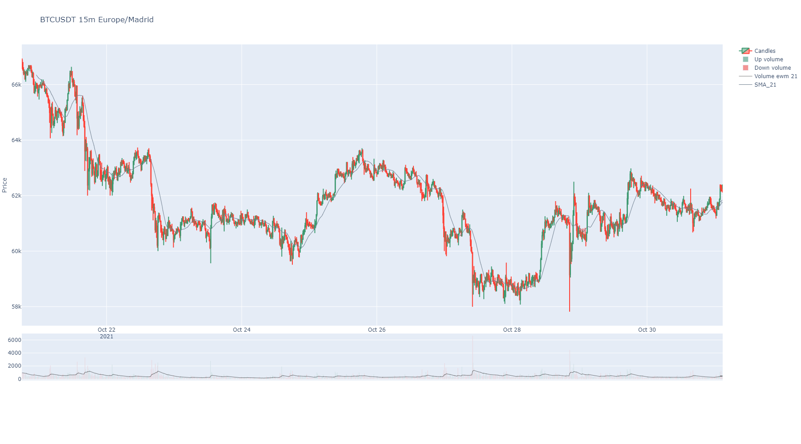

Welcome to BinPan's documentation!
==================================

BinPan is a Python wrapper for Binance API, creating objects with many capabilities to analyze data.

BinPan can make plots easily and grab API requests in the same object. It can also obtain some technical indicators.

The objective of this module is to have a fast tool to collect and handle data from the Binance API in an agile way.

It is intended to be useful in Jupyter Notebooks or even the python console, but it can be used in many other ways.

BinPan manages symbol objects that can:

- get candles with time zone and indexing options.
- get trades.
- calculate technical indicators.
- plot candles, histograms, indicators, etc in a very simple and beautiful way.
- check applied fees.

An example of a plot for candles and indicators:

.. image:: images/candles.png
   :width: 1000
   :alt: Candles with some indicators

Hope you find it useful breaking the market!!!

Documentation
-------------
Take a look to the basic **tutorial**. Find it in the Jupyter Notebook file **tutorial.ipynb**

https://nand0san.github.io/binpan_studio/

Python Version
--------------

Google colab ready: **python 3.7.9**

GitHub repo
-----------
https://github.com/nand0san/binpan_studio

Installation
------------

.. code-block:: bash

   pip install binpan

Usage
-----

There is a tutorial in a Jupyter Notebook file in  the github repo.

https://github.com/nand0san/binpan_studio/blob/main/tutorial.ipynb

Importing just like this:

.. code-block:: python

    import binpan

    btcusdt = binpan.Symbol(symbol='btcusdt',
                            tick_interval='15m',
                            time_zone='Europe/Madrid',
                            end_time='2021-10-31 03:00:00')
    btcusdt.sma(21)
    btcusdt.plot()

Greetings
---------

Thanks to the **pandas_ta** people for that great library.

Hope you find it useful breaking the market!!!

.. toctree::
   :maxdepth: 2
   :caption: Contents:

   binpan.rst
   market.rst
   exceptions.rst
   plotting.rst
   strategies.rst

Indices and tables
==================

* :ref:`genindex`
* :ref:`modindex`
* :ref:`search`
