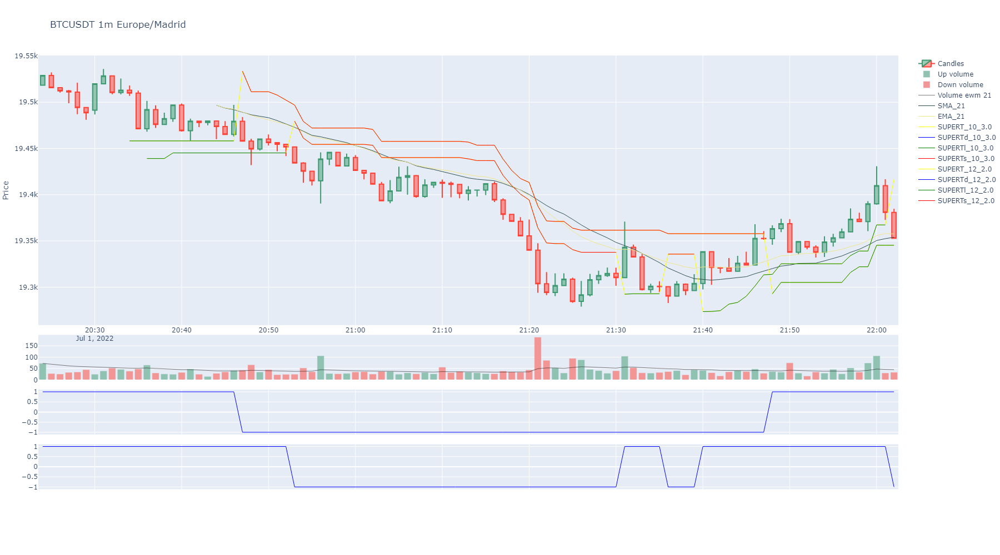
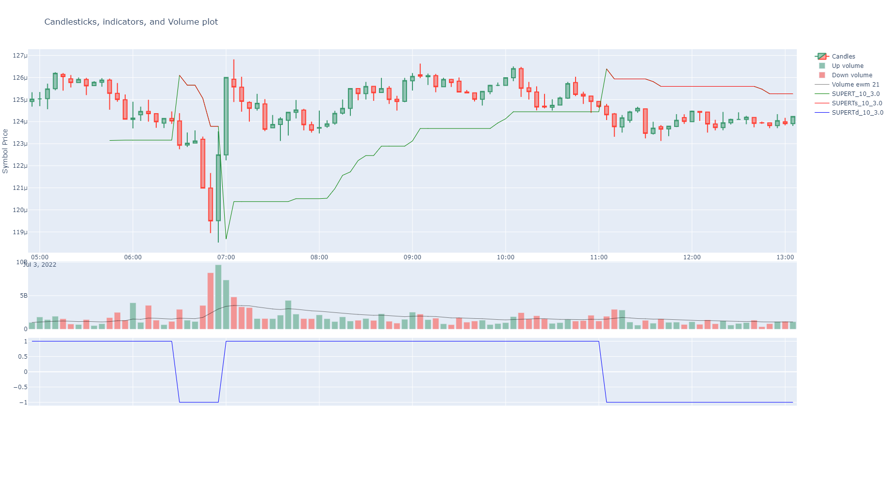

Welcome to BinPan's documentation!
==================================

BinPan is a Python wrapper for the Binance API oriented towards market data analysis:
candlestick (kline) data, trades, technical indicators, plotting, and strategy backtesting.

**Requires Python >= 3.12.** Published on `PyPI <https://pypi.org/project/binpan/>`_ under the MIT license.

Features
--------

- Fetch candlestick (OHLCV) data with timezone and indexing options.
- Fetch atomic and aggregated trades.
- Native technical indicators (EMA, SMA, RSI, MACD, Bollinger Bands, Supertrend, Ichimoku, VWAP, Stochastic, fractals, and more).
- Interactive candlestick charts with Plotly: indicators, buy/sell markers, trade bubble charts, order book, market profile.
- Support and resistance detection via K-Means clustering (static, rolling, discrete interval).
- Strategy tagging and backtesting engine with stop loss, target, entry filters, and ROI/profit metrics.
- Exchange metadata: order types, filters, fees, coin networks, 24h volume ranking.
- CSV export/import for klines and trades.
- PostgreSQL/TimescaleDB integration for historical data storage.
- Heikin-Ashi candles, reversal charts from tick data, kline resampling.

.. note::

    BinPan contains no Binance order method, withdraw method or any dangerous command.

    If you decide to add API keys for account methods, BinPan will encrypt them in a file
    and in memory, but it is recommended not to enable trading capability in your Binance API
    key configuration.

    Be careful out there!

Installation
------------

.. code-block:: bash

   pip install binpan

Quick Start
-----------

.. code-block:: python

    import binpan

    btcusdt = binpan.Symbol(symbol='btcusdt',
                            tick_interval='15m',
                            time_zone='Europe/Madrid',
                            limit=200)
    btcusdt.ema(21)
    btcusdt.supertrend()
    btcusdt.plot()

Example Notebooks
-----------------

The ``notebooks/`` folder contains Jupyter Notebooks organized by topic:

.. list-table::
   :header-rows: 1
   :widths: 5 30 65

   * - #
     - Notebook
     - Topic
   * - 01
     - basic_tutorial
     - Getting started: data, indicators, plots, trades
   * - 02
     - data_analysis
     - Analysis: indicators, trades, market profile, order book
   * - 03
     - technical_indicators
     - Full indicator catalogue
   * - 04
     - plotting
     - All visualization capabilities
   * - 05
     - reversal_charts
     - Reversal candles from atomic trades
   * - 06
     - tagging_and_backtesting
     - Strategy signals and backtesting
   * - 07
     - support_resistance_kmeans
     - S/R with K-Means clustering
   * - 08-10
     - ichimoku_*
     - Ichimoku analysis and backtesting
   * - 11
     - exchange_info
     - Exchange class: metadata, filters, fees
   * - 12
     - export_csv
     - CSV export/import
   * - 13-15
     - database_*
     - PostgreSQL/TimescaleDB integration

GitHub repo
-----------

https://github.com/nand0san/binpan_studio

Google Colab
------------

Google Colab is not available for the Binance API due to IP restrictions.

Jupyter Import Troubleshooting
------------------------------

If you encounter import errors in Jupyter, install packages directly to the kernel:

.. code-block:: python

    import sys
    !{sys.executable} -m pip install binpan

.. toctree::
   :maxdepth: 2
   :caption: Main Classes:

   binpan.rst
   symbol_indicators.rst
   symbol_plotting.rst
   symbol_strategy.rst

.. toctree::
   :maxdepth: 2
   :caption: API & Market:

   market.rst
   exchange.rst
   quest.rst
   wallet.rst

.. toctree::
   :maxdepth: 2
   :caption: Analysis:

   indicators.rst
   aggregations.rst
   strategies.rst
   tags.rst
   stat_tests.rst
   numba_tools.rst

.. toctree::
   :maxdepth: 2
   :caption: Core:

   time_helper.rst
   timeframes.rst
   trades.rst
   standards.rst
   starters.rst
   logs.rst
   exceptions.rst
   messages.rst

.. toctree::
   :maxdepth: 2
   :caption: Plotting:

   plotting.rst

.. toctree::
   :maxdepth: 2
   :caption: Storage & Database:

   files.rst
   postgresql.rst
   postgresql_database.rst
   influx_manager.rst
   redis_fetch.rst

Indices and tables
==================

* :ref:`genindex`
* :ref:`modindex`
* :ref:`search`
